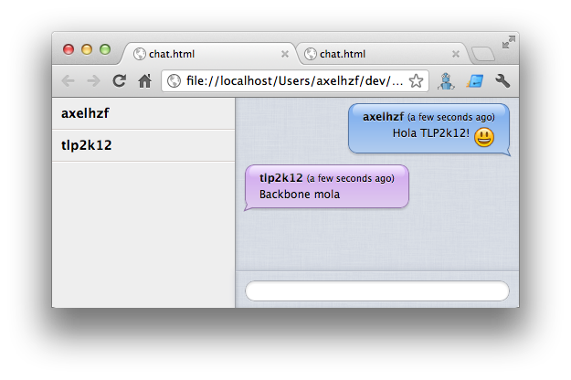
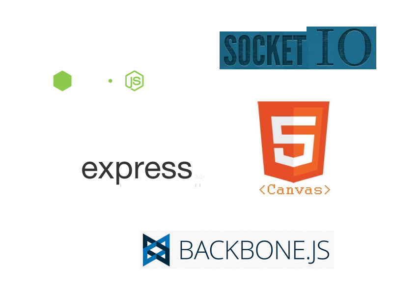
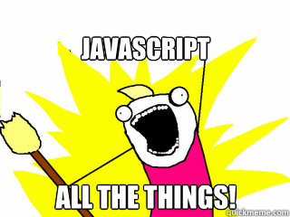
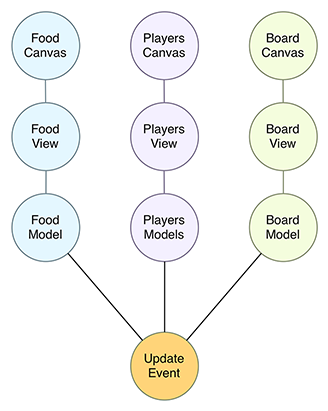

# Node.js
## Real-time multiplayer game

#### TLP2K13

[Código fuente](https://github.com/axelhzf/node-multiplayer-snake)

[Demo](http://axelhzf-snake.nodejitsu.com/)

Axel Hernández Ferrera

---

## ¿Quién soy?

[axelhzf.com](http://www.axelhzf.com)

[@axelhzf](http://www.twitter.com)

---

## Previously...

### Backbone.js : Clientside MVC Framework TLP2k12

http://axelhzf.com/chat

---

## ¿Qué vamos a hacer este año?

http://axelhzf-snake.nodejitsu.com/

---

## Tecnologías

---

## Tecnologías

---

# Node.js

---

## ¿Qué es Node.js?

> Node.js is a platform built on Chrome's JavaScript runtime for easily building fast, scalable network applications.
> Node.js uses an event-driven, non-blocking I/O model that makes it lightweight and efficient.

---

## Características

* Creado por Ryan Dahl
* Buit on top of the V8 Javascript Engine
* Server-side Javascript process
* Non-blocking
* Event-driven I/O
* Module system, I/O bindings, Common Protocols

---

---

## Hello World

hello.js

    console.log('Hello world')

Ejecución

    > node hello.js

---

## Hello Server world

helloServer.js

    var http = require('http');
    http.createServer(function (req, res) {
      res.writeHead(200, {'Content-Type': 'text/plain'});
      res.end('Hello World\n');
    }).listen(1337, "127.0.0.1");
    console.log('Server running at http://127.0.0.1:1337/');

Ejecución

    > node helloServer.js

---

## Tradicional I/O

    var fileContent = file.read('file.txt');
    process(fileContent);
    otherProcess();

---

## Tradicional I/O

    var fileContent = file.read('file.txt')
    // wait
    process(fileContent);
    otherProcess();

---

## Non-blocking I/O

    file.read('file.txt', function (fileContenet) {
        process(fileContent);
    });
    otherProcess();

No hay necesidad de esperar a la lectura de disco para seguir ejecutando código.

---

## Non-blocking I/O

Se trabaja de manera similar a cuando trabajamos con aplicaciones web Ajax

    $.getJSON('file.json', function (fileContent) {
        process(fileContent);
    });

---

## Single thread

El código se ejecuta en un único thread

    file.read('file.txt', function () {
        // este código nunca se va a ejecutar
    });

    while(true) {
        // bloqueo del proceso
    }

---

## Multicore??

Lanzar varios procesos

http://nodejs.org/docs/latest/api/cluster.html
https://github.com/nodejitsu/forever

---

## Callback Hell

    file.read('file1.txt', function (file1) {
        file.read('file2.txt', function (file2) {
            file.read('file3.txt', function (file3) {
                file.read('file4.txt', function (file4) {
                    file.read('file5.txt', function (file5) {
                        process(file1, file2, file3, file4, file5);
                    }
                }
            }
        }
    }

http://callbackhell.com/

---

## Callback Hell Solution 1 : Split the code

    var process = function (file1, file2) {}
    var readfile2 = function (cb) { file.read('file2.txt', process); }
    var readfile1 = function (cb) { file.read('file1.txt', readfile2);}
    readfile1();

---

## Callback Hell Solution 2 : Async

    var async = require('async');
    var files = ['file1.txt','file2.txt','file3.txt'];
    async.map(files, file.read, function(err, results){
        // results is now an array of stats for each file
    });

https://github.com/caolan/async

---

## CommonJS Modules

hello.js

    exports.world = function () {
        return 'Hello World';
    };

main.js

    var hello = require('./hello');
    console.log(hello.world());

---

## NPM - Node Package Manager

https://npmjs.org/

---

## NPM - Modules

    Total Packages: 34 733

    2 780 504	 downloads in the last day
    14 746 709	 downloads in the last week
    54 902 772	 downloads in the last month

<small>(10 julio 2013)</small>

---

## NPM - Uso

    npm install underscore
    npm install underscore --save
    npm install underscore --save-dev
    npm install grunt -g

---

## NPM - package.json

    {
        "name": "tlp2k13",
        "version": "0.0.1",
        "dependencies": {
            "underscore": "~1.4.4",
            "backbone": "~1.0.0"
        },
        "devDependencies": {
            "node-dev": "~2.0.1"
        },
        "engines": {
            "node": "0.8.x",
            "npm": "1.2.x"
        },
        "subdomain": "axelhzf-snake"
    }

Descargar todas las dependencias

    > npm install

---

## Node-dev

Recarga automáticamente la aplicación cuando detecta cambios en alguno de los ficheros

    npm install -g node-dev
    node-dev app.js

---

# Express.js

### web application framework for node

---

## Express.js

    npm install express -g
    express example
    cd example
    npm install
    node app.js

---

## Express.js

app.js

    app.get('/tlp2k13', function (req, res) {
    	res.send('Hello world TLP2k13');
    });

    app.get('/api/tlp2k13', function (req, res) {
        res.json({msg : 'Hello world TLP2k13'});
    });

---

## Websockets

Websockets permite establecer una conexión permanente entre el navegador y el servidor.

El cliente y el servidor pueden enviar información en cualquier momento.

* [Artículo de introducción a websockets](http://www.html5rocks.com/en/tutorials/websockets/basics/)
* [Can I use webosckets?](http://caniuse.com/websockets)

---

## Socket.io

Realtime application framework for Node.JS, with HTML5 WebSockets and cross-browser fallbacks support.

---

## Socket.io : client

Transports

- WebSocket
- Adobe® Flash® Socket
- AJAX long polling
- AJAX multipart streaming
- Forever Iframe
- JSONP Polling

---

## Socket.io

Instalación

    npm install socket.io --save

---

## Socket.io + Express

    var io = require('socket.io');

    var server = http.createServer(app);
    io.listen(server);
    server.listen(app.get('port'), function () {
        console.log('Express server listening on port ' + app.get('port'));
    });

---

## Socket.io Example

server

    io.sockets.on('connection', function (socket) {
      socket.emit('news', { hello: 'world' });
      socket.on('my other event', function (data) {
        console.log(data);
      });
    });

client

    var socket = io.connect('http://localhost');
    socket.on('news', function (data) {
        console.log(data);
        socket.emit('my other event', { my: 'data' });
    });

---

## Snake

---

## Proyecto base

[Descargar](src/snake-base.zip)

---

## Aproximación

- En juegos multijugadores real, la lógica del juego se debe calcular tanto en
el cliente como en el servidor
- Snake es un juego muy simple, podemos simplicar la implementación
y ejecutar toda la lógica en el servidor

---

## Comunicación cliente servidor

* Para que el cliente sea capaz de pintar la pantalla del juego:
 * Tamaño del grid
 * Posición de cada uno de los jugadores (cada uno de los cuadrados que lo compone)
 * Posición de la comida
 * Puntuación

---

## Formato de la comunicación

    {
      "players": [
        {
          "id": "9k-EPXiTlUO5qk2gtzPN", "username": "anonymous2"
          "parts": [ { "x": 1, "y": 0 }, { "x": 2, "y": 0 } ],
          "direction": {"x": 1, "y": 0},
        }
      ],
      "food": [{ "id": "c3", "x": 22, "y": 30}],
      "board": {"x": 50, "y": 50, "cellWidth": 10, "cellHeight": 10 },
      "scores": [
        { "username": "anonymous2", "score": 0, "maxScore": 0}
      ]
    }

---

## Formato de la comunicación

* Cada una de las claves principales (players, food, board, scores) es opcional
* El servidor se encarga de enviar únicamente las partes que necesitan actualizarse de esta forma se reduce la comunicación

---

## Cliente

Para implementar el cliente vamos a utilizar canvas directamente.

Si vas a hacer un juego más serio échale un vistazo a alguna librería:

* [ImpactJs](http://impactjs.com/)
* [Quintus](http://html5quintus.com/)

---

## Canvas: Context

    <canvas width="50" height="50"></canvas>

    var ctx = $('.canvas')[0].getContext("2d");

---

## Canvas : lineas

    ctx.moveTo(x0, y0);
    ctx.lineTo(x1, y1);
    ctx.strokeStyle = "#074547";
    ctx.stroke();

---

## Canvas : cuadrados

    ctx.fillStyle = "#074547";
    ctx.fillRect(x, y, width, height);

---

## Canvas : clear

    ctx.clearRect(0, 0, width, height);

---

## requestAnimationFrame

API for use with animation, whether that be DOM-based styling changes, canvas or WebGL.

[requestAnimationFrame for Smart Animating - Paul Irish](http://www.paulirish.com/2011/requestanimationframe-for-smart-animating/)

---

## Canvas performance

Renderizar en multiples canvas superpuestos mejora el rendimiento.

[Canvas performance - HTML5 rocks](http://www.html5rocks.com/en/tutorials/canvas/performance/)

---

## Line at 0.5px

[Canvas Paths Ask Professor Markup section](http://diveintohtml5.info/canvas.html)

---

## Flujo de actualización

---

## BoardView

    (function () {
        "use strict";

        Game.BoardView = Backbone.View.extend({

            initialize : function (options) {
                this.ctx = options.ctx;
                this.board = options.board;
                this.listenTo(this.board, "change", this.render);
            },

            draw : function () {
                var cellWidth = this.board.get('cellWidth');
                var cellHeight = this.board.get('cellHeight');
                var boardWidth = this.board.get('x') * cellWidth;
                var boardHeight = this.board.get('y') * cellHeight;

                for (var x = 0; x <= this.board.get('x'); x++) {
                    this.ctx.moveTo(0.5 + x * cellWidth, 0);
                    this.ctx.lineTo(0.5 + x * cellWidth, boardHeight);
                }

                for (var y = 0; y <= this.board.get('y'); y++) {
                    this.ctx.moveTo(0, 0.5 + y * cellHeight);
                    this.ctx.lineTo(boardWidth, 0.5 + y * cellHeight);
                }
                this.ctx.strokeStyle = "#074547";
                this.ctx.stroke();
            },

            render : function () {
                requestAnimationFrame(_.bind(this.draw, this));
            }

        });

    }());

---

## Test BoardView

Game.js

    this.board.set({
        "x": 50,
        "y": 50,
        "cellWidth": 10,
        "cellHeight": 10
    });

---

## FoodView

    Game.FoodView = Backbone.View.extend({

        initialize : function (options) {
            this.ctx = options.ctx;
            this.board = options.board;
            this.food = options.food;

            this.listenTo(this.food, "reset", this.render);
        },

        draw : function () {
            this.ctx.clearRect(0, 0, this.ctx.canvas.width, this.ctx.canvas.height);

            var cellWidth = this.board.get('cellWidth');
            var cellHeight = this.board.get('cellHeight');

            this.ctx.fillStyle = "#D8FD06";
            this.food.each(function (f) {
                var x = f.get('x');
                var y = f.get('y');
                this.ctx.fillRect(x * cellWidth + 0.5, y * cellHeight + 0.5, cellWidth, cellHeight );
            }, this);
        },

        render : function () {
            requestAnimationFrame(_.bind(this.draw, this));
        }

    });

---

## Test FoodView

Game.js

    this.food.reset([
        { "id": "c1", "x": 10, "y": 10},
        { "id": "c2", "x": 20, "y": 20}
    ]);

---

## PlayersView

    (function () {
        "use strict";

        Game.PlayersView = Backbone.View.extend({

            initialize : function (options) {
                this.ctx = options.ctx;
                this.players = options.players;
                this.board = options.board;
                this.listenTo(this.players, 'reset', this.render);
            },

            color : function (player) {
                return player.get('username') === Game.username ? "#00FEFF" : "#FF0065";
            },

            draw : function () {
                var self = this;
                var cellWidth = this.board.get('cellWidth');
                var cellHeight = this.board.get('cellHeight');

                this.ctx.clearRect(0, 0, this.ctx.canvas.width, this.ctx.canvas.height);
                this.players.each(function (player) {
                    this.ctx.fillStyle = self.color(player);
                    _.each(player.get('parts'), function (part) {
                        this.ctx.fillRect(part.x * cellWidth, part.y * cellHeight, cellWidth, cellHeight);
                    }, this);
                }, this);
            },

            render : function () {
                requestAnimationFrame(_.bind(this.draw, this));
            }

        });

    }());

---

## Test PlayersView

    this.players.reset([
        {
            "id": "9k-EPXiTlUO5qk2gtzPN",
            "username": "axelhzf",
            "parts": [ { "x": 1, "y": 0 }, { "x": 2, "y": 0 } ],
            "direction": {"x": 1, "y": 0}
        }
    ]);

---

## Test ScoreView

    this.scores.reset([
        { "username": "axelhzf", "score": 1, "maxScore": 10}
    ]);

---

## Server

---

## New player

GameServer.js

    bindSocketsEvents : function () {
        var self = this;
        this.io.sockets.on('connection', function (socket) {
            socket.on('addPlayer', _.bind(self.onSocketAddPlayer, self, socket));
            socket.on('disconnect', _.bind(self.onSocketDisconnect, self, socket));
            socket.on('keydown', _.bind(self.onSocketKeydown, self, socket));
        });
    },

    onSocketAddPlayer : function (socket, username) {
        console.log('Add player' + username);
        this.players.add({username : username, socket : socket, board : this.board});
        if (this.players.length === 1) {
            this.startIntervals();
        }
    },

Game.js

    var socket = io.connect('/');
    socket.emit('addPlayer', this.username);

---

## Intervals

    startIntervals : function () {
        this.stopIntervals();
        console.log("start intervals");
        this.gameLoopIntervalesId = setInterval(_.bind(this.gameLoop, this), 100);
        this.addFoodIntervalId = setInterval(_.bind(this.addFood, this), 3000);
    },

    stopIntervals : function () {
        console.log("stop intervals");

        if (this.gameLoopIntervalesId) {
            clearInterval(this.gameLoopIntervalesId);
        }

        if (this.addFoodIntervalId) {
            clearInterval(this.addFoodIntervalId);
        }
    }

---

## Disconnect

    onSocketDisconnect : function (socket) {
        var player = this.players.get(socket.id);
        if (player) {
            this.players.remove(player);
        }
        if (this.players.length === 0) {
            this.stopIntervals();
        }
    },

---

## GameLoop Server

    gameLoop : function () {
        this.players.invoke('movePosition');
        this.detectCollisions();
        var data = this.updateData();

        this.players.each(function (player) {
            player.get('socket').emit('update', data);
        });
    },

---

## Gameloop update data

    updateData : function () {
        var data = {};
        if (this.updateDataFields.players) {
            data.players = this.players.toJSON();
        }
        if (this.updateDataFields.food) {
            data.food = this.foodCollection.toJSON();
        }
        if (this.updateDataFields.board) {
            data.board = this.board.toJSON();
        }
        if (this.updateDataFields.scores) {
            data.scores = this.players.invoke("pick", "username", "score", "maxScore");
        }
        this.updateDataFields = {players : true};
        return data;
    },

---

## Bind Model events

    bindModelEvents : function () {
        var self = this;

        var includeScores = function () {
            self.updateDataFields.scores = true;
        };
        this.players.on('add', includeScores);
        this.players.on('remove', includeScores);
        this.players.on('change:score', includeScores);

        var includeFood = function () {
            self.updateDataFields.food = true;
        };
        this.foodCollection.on('add', includeFood);
        this.foodCollection.on('remove', includeFood);
        this.players.on('add', includeFood);

        this.players.on('add', function () {
            self.updateDataFields.board = true;
        });
    },

---

## GameLoop client

Game.js

    var self = this;
    socket.on('update', function (data) {
        if (data.board) {
            self.board.set(data.board);
        }
        if (data.players) {
            self.players.reset(data.players);
        }
        if (data.food) {
            self.food.reset(data.food);
        }
        if (data.scores) {
            self.scores.reset(data.scores);
        }
    });

---

## Player movePosition

Player.js

    movePosition : function () {
        var board = this.get('board');

        var newPart = _.clone(this.attributes.parts[0]);

        this.calculateNewDirection();
        newPart.x = newPart.x + this.attributes.direction.x;
        newPart.y = newPart.y + this.attributes.direction.y;

        // control game limits
        if (newPart.x < 0) {
            newPart.x = board.get('x');
        } else if (newPart.x >= board.get('x')) {
            newPart.x = 0;
        }

        if (newPart.y < 0) {
            newPart.y = board.get('y');
        } else if (newPart.y >= board.get('y')) {
            newPart.y = 0;
        }

        this.lastRemovedPart = this.attributes.parts.pop();
        this.attributes.parts.unshift(newPart);
    },

---

## Add Food

    addFood : function () {
        if (this.foodCollection.length < 10) {
            var x = _.random(0, this.board.get('x') - 1);
            var y = _.random(0, this.board.get('y') - 1);
            this.foodCollection.add({x : x, y : y});
        }
    },

---

## Controls - client

Game.js

        var controls = new Game.Controls();
        controls.on('keydown', function (key) {
            socket.emit('keydown', key);
        });
        controls.start();

---

## Controls - server

GameServer.js

    onSocketKeydown : function (socket, key) {
        var player = this.players.get(socket.id);
        player.set('lastKey', key);
    },

Player.js

    calculateNewDirection : function () {
        var key = this.get('lastKey');
        var direction = this.get('direction');

        if (key === "LEFT" && direction.y) {
            this.set('direction', {x : -1, y : 0});
        } else if (key === "RIGHT" && direction.y) {
            this.set('direction', {x : 1, y : 0});
        } else if (key === "UP" && direction.x) {
            this.set('direction', {x : 0, y : -1});
        } else if (key === "DOWN" && direction.x) {
            this.set('direction', {x : 0, y : 1});
        }
    },

---

## Collisions

GameServer.js

    detectCollisions : function () {
        var playersParts = this.players.pluck('parts');

        var heads = _.map(playersParts, function (parts) {
            return _.first(parts);
        });

        //Collisions
        _.each(heads, function (head, i) {
            var collidedFood = this.foodCollection.find(function (food) {
                return head.x === food.get('x') && head.y === food.get('y');
            });

            if (collidedFood) {
                this.foodCollection.remove(collidedFood);
                this.players.at(i).eat();
            }

            var collidedPlayer = _.find(playersParts, function (parts, j) {
                if (i === j) {
                    parts = parts.slice(1);
                }
                var collidedPart = _.find(parts, function (part) {
                    return head.x === part.x && head.y === part.y;
                });
                return !_.isUndefined(collidedPart);
            });

            if (collidedPlayer) {
                this.players.at(i).die();
            }

        }, this);
    },

---

## Player eat & die

Player.js

    die : function () {
        var parts = this.get('parts').slice(0, 1);
        this.set('parts', parts);
        this.set('score', 0);
    },

    eat : function () {
        this.get('parts').push(this.lastRemovedPart);

        var score = this.get('score') + 1;
        this.set('score', score);
        if (score > this.get('maxScore')) {
            this.set('maxScore', score);
        }
    },

---

# Qué es lo siguiente?

---

## Testing

[Testing socket.io](http://liamkaufman.com/blog/2012/01/28/testing-socketio-with-mocha-should-and-socketio-client/)

---

## Cross Platform

[Objective-C WebSocket Client](https://github.com/square/SocketRocket)

[WebSocket and Socket.IO client for Android](https://github.com/koush/android-websockets)

---

#Tron

[Prueba a implementar un tron](https://www.google.com/search?q=tron&source=lnms&tbm=isch&sa=X&ei=TErkUeudEJDH7Ab42oD4Dg&ved=0CAcQ_AUoAQ&biw=1231&bih=634)

---

# Gracias

Comentarios a [@axelhzf](http://www.twitter.com/axelhzf)

